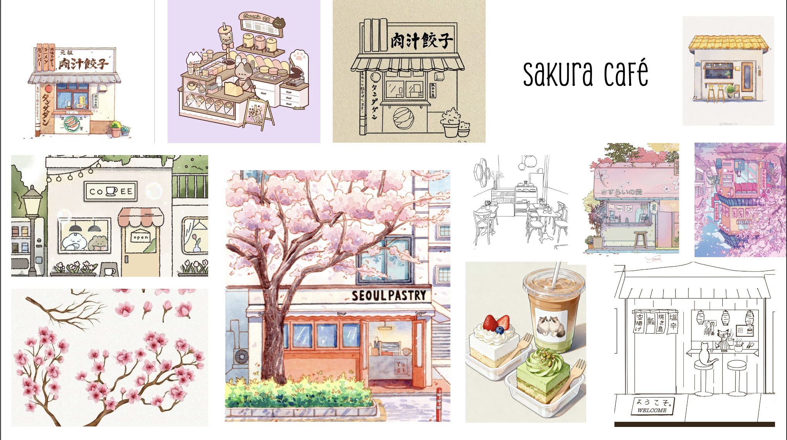

# SAKURA CAFÉ

Jouez en tant que serveur au Sakura Café pendant des journées occupées et garder les clients heureux pour faire grandir votre restaurant !

## Description spécifique

Une expérience immersive VR dans laquelle le joueur incarne un nouvel employé au Sakura Café, un restaurant spécialisé dans la cuisine japonaise moderne. Le joueur doit réussir trois jours d’essai afin de prouver ses compétences et conserver son emploi.

Durant ces trois jours, le joueur devra apprendre à gérer la préparation des commandes tout en respectant les attentes des clients. La difficulté augmente progressivement : le nombre de clients s’intensifie, les commandes deviennent plus complexes et le temps accordé pour les préparer diminue.

Lors du tutoriel, le joueur découvre les bases du fonctionnement du restaurant. Il apprend à utiliser les équipements, à lire les commandes et à préparer les plats et boissons offerts au menu afin de bien comprendre les mécaniques du jeu avant de commencer les journées d’essai.

Par exemple, sur le menu, le commerce vend du café glacé avec des étapes précises tel que choisir le format du verre, ajouter des glaçons, verser une quantité de café et de lait, ajouter du sucre, mélanger et puis finalement servir le client. Pour les desserts, l'employé va devoir la prendre de la vitrine du magasin.

## Moodboard visuel (intérieur et extérieur)

## Ambiance sonore
[Écouter le son](https://github.com/mar-iamm/tp3_mariam_chaima/blob/main/bounce-bay-records-traditional-japanese-3-437933.mp3)
[Écouter le son](https://github.com/mar-iamm/tp3_mariam_chaima/blob/main/lofidreams-lofi-jazz-music-485312.mp3)
## Carte environnementale
## Schema d'intéractivité

